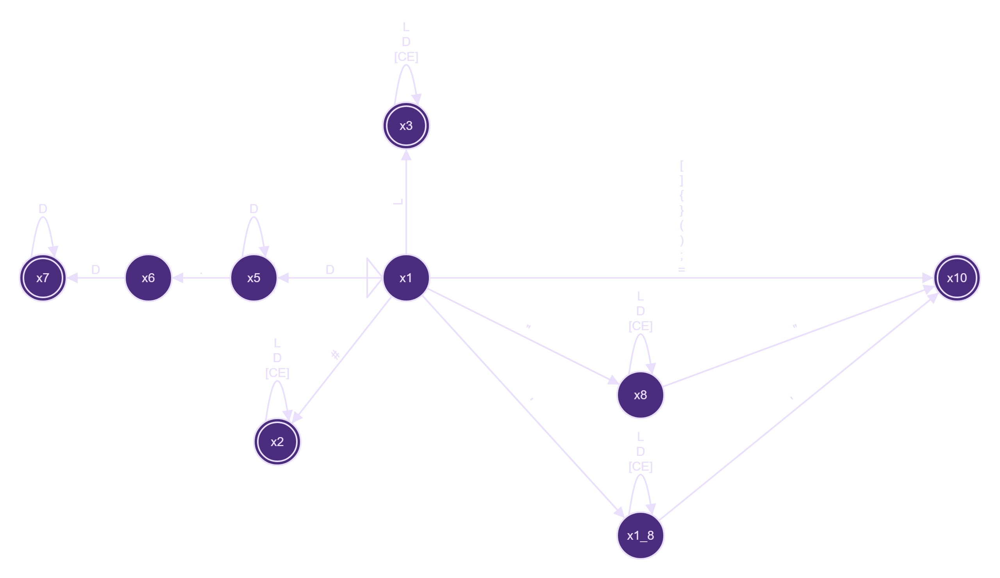

# Análisis Sintáctico : Parsing en JavaScript

## Introducción

Este repositorio implementa un analizador léxico y sintáctico en JavaScript para un lenguaje simple definido por la gramática especificada en el archivo `grammar.txt`. El proyecto sirve como un ejemplo práctico de cómo funcionan los analizadores de compiladores y los parsers.

## Tabla de Contenidos

1. [Configuración del Proyecto](#configuración-del-proyecto)
2. [Gramática del Lenguaje](#gramática-del-lenguaje)
3. [Estructura del Proyecto](#estructura-del-proyecto)
4. [Componentes Principales](#componentes-principales)
    - [Analizador Léxico](#analizador-léxico)
    - [Analizador Sintáctico](#analizador-sintáctico)
5. [Flujo de Ejecución](#flujo-de-ejecución)
6. [Ejemplos Prácticos](#ejemplos-prácticos)
7. [Manejo de Errores](#manejo-de-errores)
8. [Glosario de Términos](#glosario-de-términos)

## Configuración del Proyecto

Para comenzar a trabajar con este proyecto, sigue estos pasos:

1. **Clonar el repositorio**:

    ```bash
    git clone https://github.com/J-Ajsivinac/Parcing_Example.git
    cd Parcing_Example
    ```

2. **Instalar dependencias**:

    ```bash
    npm install
    # O si prefieres usar pnpm
    pnpm install
    ```

3. **Ejecutar el programa**:
    ```bash
    npm start
    # O usando pnpm
    pnpm run start
    ```

## Diagrama de Flujo del Proyecto

```
Archivo de entrada (test.txt)
    ↓
Lectura de archivo (fileReader.js)
    ↓
Análisis Léxico (lexer/index.js)
    ↓
Lista de Tokens (token.js con tipos de tokenTypes.js)
    ↓
Análisis Sintáctico (parser/index.js)
    ↓
Resultado: Éxito o Lista de Errores (error.js)
```

Este comando ejecutará el análisis léxico y sintáctico en el archivo de prueba `test.txt`.

## AFD

Donde: L = [A-Za-z] D = [0-9] CE = [!$%&/()...] Sin inculir el salto de linea CE1 = [!$%&/()...]



## Gramática del Lenguaje

El lenguaje que este analizador procesa está definido por la siguiente gramática BNF (Backus-Naur Form):

```
<programa> ::= <comando> { <comando> }

<comando> ::= <claves>
            | <imprimir>

<claves> ::= "Claves" "=" "[" <lista_cadenas> "]" ";"

<lista_cadenas> ::= <cadena> { "," <cadena> }
                  |  epsilon

<imprimir> ::= "imprimir" "(" <cadena> ")" ";"

<cadena> ::= STRING_LITERAL
```

Esta gramática permite definir programas simples que consisten en:

-   Declaraciones de claves como listas de cadenas: `Claves = ["valor1", "valor2"];`
-   Comandos para imprimir cadenas: `imprimir("Hola Mundo");`

## Estructura del Proyecto

El proyecto está organizado de la siguiente manera:

```
/
├── grammar.txt         # Definición formal de la gramática
├── index.js            # Punto de entrada de la aplicación
├── test.txt            # Archivo de prueba con código fuente
├── package.json        # Configuración del proyecto
└── src/
    ├── interfaces/     # Interfaces y clases abstractas
    │   └── expression.js
    ├── lexer/          # Componentes del analizador léxico
    │   ├── index.js    # Implementación principal del lexer
    │   ├── token.js    # Clase Token
    │   └── tokenTypes.js # Definición de tipos de tokens
    ├── parser/         # Componentes del analizador sintáctico
    │   ├── index.js    # Implementación del parser
    └── utils/          # Utilidades
        ├── error.js    # Manejo de errores
        ├── fileReader.js # Lectura de archivos
        └── validate.js # Validación de caracteres
```

## Componentes Principales

### Analizador Léxico

El analizador léxico (también conocido como lexer o scanner) es el primer paso en el proceso de compilación. Su trabajo es convertir una secuencia de caracteres (el código fuente) en una secuencia de tokens.

#### ¿Qué es un Token?

Un token es la unidad mínima de significado en un lenguaje de programación. Por ejemplo, en la expresión `x = 5 + y`, los tokens serían:

-   `x` (identificador)
-   `=` (operador de asignación)
-   `5` (literal numérico)
-   `+` (operador de suma)
-   `y` (identificador)

#### Funcionamiento del Lexer

El lexer de este proyecto:

1. Lee el archivo de entrada carácter por carácter.
2. Identifica patrones válidos (palabras clave, símbolos, cadenas, etc.).
3. Crea tokens para cada patrón reconocido.
4. Maneja errores léxicos (caracteres no válidos).

Ejemplo de código del lexer:

```javascript
// Ejemplo simplificado
analizar(cadena) {
    while (cadena) {
        // Ignorar espacios en blanco
        cadena = this.limpiar(cadena);
        if (!cadena) break;

        // Analizar según el estado actual
        switch (this.estado) {
            case 1:
                cadena = this.x_1(cadena); // Estado inicial
                break;
            case 2:
                cadena = this.x_2(cadena); // Procesando identificadores
                break;
            // Otros estados...
        }
    }
    return { tokens: this.tokens, errores: this.errores };
}
```

### Analizador Sintáctico

El analizador sintáctico (o parser) toma la secuencia de tokens generada por el lexer y verifica si sigue las reglas gramaticales del lenguaje.

#### Funcionamiento del Parser

El parser de este proyecto:

1. Recibe una lista de tokens del lexer.
2. Implementa un parser recursivo descendente que sigue la gramática definida.
3. Verifica que la secuencia de tokens forme estructuras válidas según la gramática.
4. Detecta y reporta errores sintácticos.
5. Implementa mecanismos de recuperación de errores para continuar el análisis.

Ejemplo de código del parser:

```javascript
// Ejemplo simplificado de un método del parser
_analizarClaves() {
    this._avanzar(); // consumir 'Claves'

    this._esperarToken(TokenTypes.EQUALS, "Se esperaba '=' después de 'Claves'");
    this._esperarToken(TokenTypes.LEFT_BRACKET, "Se esperaba '[' después de '='");

    this._analizarListaStrings();

    this._esperarToken(TokenTypes.RIGHT_BRACKET, "Se esperaba ']' para cerrar la lista");
    this._esperarToken(TokenTypes.SEMICOLON, "Se esperaba ';' al final de la declaración");

    return true;
}
```

## Flujo de Ejecución

El flujo completo del programa sigue estos pasos:

1. **Lectura del archivo**: Se lee el archivo de entrada usando `fileReader.js`.
2. **Análisis léxico**: La clase `Lexer` analiza el contenido del archivo y genera tokens.
3. **Análisis sintáctico**: La clase `Parser` verifica que los tokens sigan la estructura definida por la gramática.
4. **Reporte de resultados**: Se muestran los tokens generados y los errores encontrados.

Código que ilustra este flujo:

```javascript
// Fragmento de index.js
function main() {
    const rutaArchivo = "./test.txt";
    const contenido = readerFile(rutaArchivo);

    // Análisis léxico
    const lexer = new Lexer();
    const result = lexer.analizar(contenido);
    console.log("Tokens:", result.tokens);

    // Análisis sintáctico
    const parser = new Parser(result.tokens);
    parser.analizar();

    if (parser.esValido()) {
        console.log("Análisis sintáctico exitoso.");
    } else {
        console.log("Errores de análisis sintáctico encontrados:");
        parser.imprimirErrores();
    }
}
```

## Ejemplos Prácticos

### Ejemplo 1: Declaración de Claves

**Código fuente:**

```
Claves = ["clave1", "clave2", "clave3"];
```

**Proceso de análisis:**

1. **Análisis léxico:** Genera los siguientes tokens:

    - `KEYWORD_KEYS` ("Claves")
    - `EQUALS` ("=")
    - `LEFT_BRACKET` ("[")
    - `STRING_LITERAL` ("clave1")
    - `COMMA` (",")
    - `STRING_LITERAL` ("clave2")
    - `COMMA` (",")
    - `STRING_LITERAL` ("clave3")
    - `RIGHT_BRACKET` ("]")
    - `SEMICOLON` (";")

2. **Análisis sintáctico:**
    - Reconoce el patrón `<claves>` según la gramática
    - Verifica que la estructura sea correcta

### Ejemplo 2: Comando de Impresión

**Código fuente:**

```
imprimir("Hola Mundo");
```

**Proceso de análisis:**

1. **Análisis léxico:** Genera los siguientes tokens:

    - `KEYWORD_PRINT` ("imprimir")
    - `LEFT_PAREN` ("(")
    - `STRING_LITERAL` ("Hola Mundo")
    - `RIGHT_PAREN` (")")
    - `SEMICOLON` (";")

2. **Análisis sintáctico:**
    - Reconoce el patrón `<imprimir>` según la gramática
    - Verifica que la estructura sea correcta

### Ejemplo 3: Código con Errores

**Código fuente con error:**

```
Claves = ["clave1", "clave2" "clave3"];
```

**Proceso de análisis:**

1. **Análisis léxico:** Genera los tokens correctamente, pero no detecta la falta de coma.

2. **Análisis sintáctico:**
    - Detecta que falta una coma entre "clave2" y "clave3"
    - Reporta un error sintáctico
    - Intenta recuperarse y continuar el análisis

## Manejo de Errores

El proyecto implementa un sistema de manejo de errores en dos niveles:

### Errores Léxicos

Ocurren cuando el lexer encuentra caracteres o secuencias de caracteres que no puede reconocer. Por ejemplo:

```
imprimir("Hola Mundo"); &
```

El símbolo `&` no está definido en el lenguaje, por lo que el lexer reportará un error.

### Errores Sintácticos

Ocurren cuando la secuencia de tokens no sigue la estructura definida por la gramática. Por ejemplo:

```
Claves = ["clave1" "clave2"];
```

Aquí falta una coma entre los valores, lo que genera un error sintáctico.

### Mecanismo de Recuperación

El parser implementa una estrategia de recuperación de errores para poder continuar el análisis incluso después de encontrar un error:

```javascript
// Ejemplo de recuperación de errores
_saltarHastaToken(tipoToken) {
    while (this.posicion < this.tokens.length) {
        const token = this._tokenActual();
        if (!token) break;
        if (token.tipo === tipoToken) break;
        this._avanzar();
    }
}
```

Este mecanismo permite detectar múltiples errores en una sola pasada, en lugar de detenerse en el primer error encontrado.

## Glosario de Términos

-   **Analizador Léxico (Lexer)**: Componente que convierte texto en tokens.
-   **Analizador Sintáctico (Parser)**: Componente que verifica la estructura de los tokens según una gramática.
-   **Token**: Unidad mínima de significado en un lenguaje de programación.
-   **Gramática**: Conjunto de reglas que definen la estructura válida de un lenguaje.
-   **BNF (Backus-Naur Form)**: Notación para expresar gramáticas libres de contexto.
-   **Análisis Recursivo Descendente**: Técnica de parsing que implementa la gramática mediante funciones recursivas.
-   **Error Léxico**: Error relacionado con caracteres no válidos o mal formados.
-   **Error Sintáctico**: Error relacionado con la estructura incorrecta según la gramática.
-   **Recuperación de Errores**: Técnicas para continuar el análisis después de encontrar un error.
-   **Estado (en lexer)**: Representa la fase actual del análisis léxico en un autómata finito.
